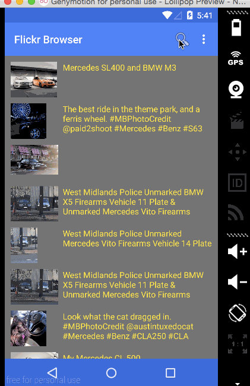

# Material Design Flickr-Browser Android app Demo

This is a material design Android demo application for displaying the Yelp search using the [Flickr API](https://www.flickr.com/services/feeds/). 

See [Udemy Android Lollipop course](https://www.udemy.com/android-lollipop-complete-development-course/?dtcode=eYA5dzE219QS) for step-by-step tutorial.

Features:

 * [x] Android 5.0 RecycleView
 * [x] Android 5.0 CardView
 * [x] Android 5.0 Material Design Toolbar
 * [x] Flickr API Search 
 

GIF created with [LiceCap](http://www.cockos.com/licecap/).
